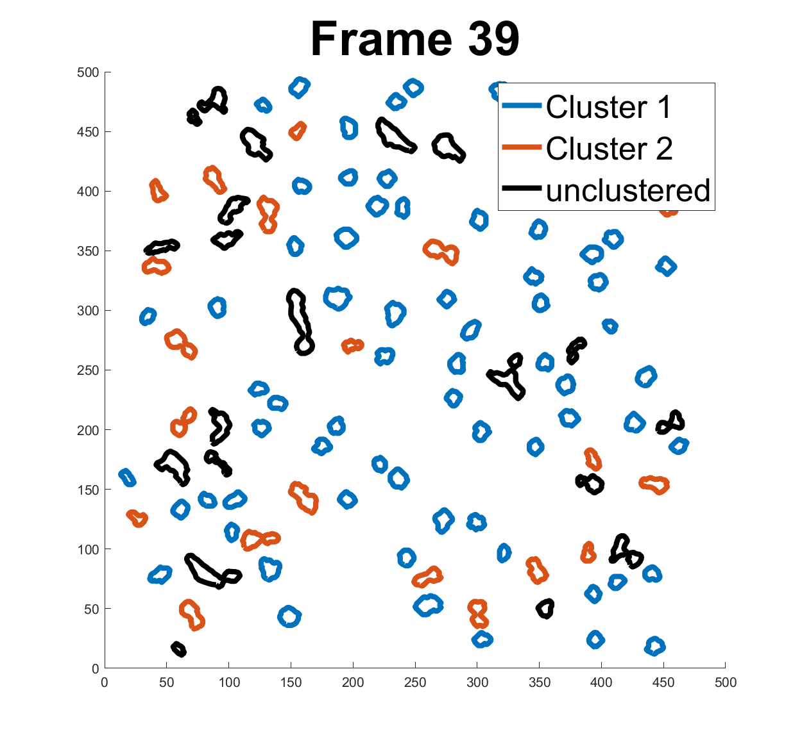

<html>
<head>
	<title>My Personal Webpage</title>
	
</head>
<body>
		<table>
		<tr>
 		<td  style="width: 25%"></td> 
		<td  style="width: 75%">		
			<h2> Michael Wilson</h2>
<!-- 			
<a href="link1">link</a>-<a href="link1">link</a>-<a href="link1">link</a>-<a href="link1">link</a> 
 -->
			
I am a Ph.D. candidate at Florida State University, Department of Statistics. I am fortunate to have the the opportunity to work under the supervision of <a href="https://anujsrivastava.com/">Prof. Anuj Srivastava</a> on projects involving Optimal Transport and Statistical Shape Analysis. My research interests also include Causal Inference and Machine Learning.

		</td> 
		</tr>
		</table>
<!-- 	</section> -->

<h2>Research</h2>
<table>
   <tr>
    <td style="width: 35%; margin-top: 0"></td> 
<td style="width: 65%; margin-top: 0">
		<h3>A Wasserstein-type Distance for Gaussian Mixtures on Vector Bundles</h3>
			
 Paper: <a href="https://arxiv.org/abs/2311.16988" target="_blank" rel="noopener noreferrer"> Arxiv </a>

			
 Code: <a href="https://github.com/mwilson221/A-Wasserstein-type-Distance-for-Gaussian-Mixtures-on-Vector-Bundles/blob/main/Nanoparticles/Applications.ipynb">Nanoparticle Application</a>, <a href="https://github.com/mwilson221/A-Wasserstein-type-Distance-for-Gaussian-Mixtures-on-Vector-Bundles/blob/main/Other/Plots.ipynb"> Sphere, Triangles, and Figures </a>,  <a href="https://github.com/mwilson221/A-Wasserstein-type-Distance-for-Gaussian-Mixtures-on-Vector-Bundles/blob/main/Other/moving_frame_walkthrough.ipynb"> Moving Frame Walkthrough</a>

</td>      
  </tr>  
  <tr>
    <td style="width: 35%"></td>
    <td style="width: 65%; margin-top: 0">
	    <h3>Optimal Transport Methods for Learning on DT-MRI data </h3>
	    
Code: <a href="https://github.com/mwilson221/Optimal-Transport-Methods-for-Learning-on-DT-MRI-data/blob/main/Dataset_Creation_hcp.ipynb">Dataset Creation/Cleaning </a>, <a href="https://github.com/mwilson221/Optimal-Transport-Methods-for-Learning-on-DT-MRI-data/blob/main/Free%20Support%20Wasserstein-type%20Barycenter_hcp.ipynb">Free Support Wasserstein-type Barycenters</a>
 </td>
  </tr>
</table>

  <h2>Other Projects</h2>
  <table>
  <tr>
    <td></td>
    <td><h3>Causal Inference</h3>
<a href="https://github.com/mwilson221/Causal-Inference/blob/main/ATE/General_Social_Survey.ipynb"> Average Treatment Effects: General Social Survey </a>
</td>
  </tr> 
<!--   <tr>
    <td></td>
    <td><h3>Machine Learning</h3>

</td>
</tr> -->
  <tr>
    <td></td>
    <td> <h3>Computer Vision</h3>
	   <a href="https://github.com/mwilson221/mwilson221.github.io/blob/main/Files/Undergraduate%20projects/Applications%20of%20PCA%20and%20Clustering%20to%20calcium%20imaging%20recordings.pdf"> PCA and Clustering Analysis of in-vivo fluorescence microscopy recordings of Zebrafish</a>
    </td>
  </tr>
  </table>
  

 

			

